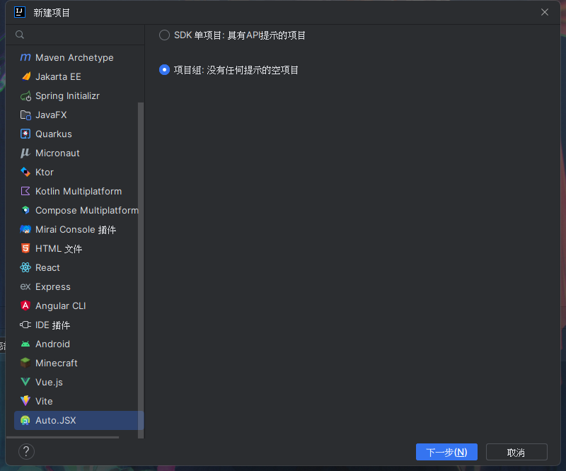

### 这是一个IDEA平台上的 Autojsx 的插件。用于帮助你在idea上更好的开发 Autojsx
[@Autojsx项目](https://github.com/kkevsekk1/AutoX) 主要以自动化、工作流为目标，更多地是方便日常生活工作，例如启动游戏时自动屏蔽通知、一键与特定联系人微信视频（知乎上出现过该问题，老人难以进行复杂的操作和子女进行微信视频）等  
该插件主要支持[kkevsekk1](https://github.com/kkevsekk1/AutoX) 维护的Autojsx

### 功能列表
* 布局分析
* 图色查找
* 项目创建与管理运行
* Kotlin + node 开发模板创建
* 多设备管理
* 程序打包
### 如何使用
1. 使用IDEA版本 2022.2.5 — 2024.2 推荐使用专业版
2. 现在插件可以在IDEA的插件中心找到，搜索名称为 Autojsx.WIFI
3. 创建项目，有两种方式，分别为 **SDK项目** 和 **项目组**
   * SDK 项目使用 node+ kotlin 开发，允许引入 node 依赖和 kotlin/js 和 kotlin 通用模块依赖。
   * 项目组是一个空项目，可以右键创建子项目，该子项目为autojs 原生编写方式

4. 在Autojsx项目内右键项目可以创建子项目，请好好的看看他。它可以创建一个 autojs 原生编写方式项目。在 SDK和项目组都可以使用
5. 关于控制台，位置在IDEA新UI的左侧，旧UI的下侧。如果你对这有点懵，你可以看看你的 run 控制台在哪（运行Java时的控制台位置）
6. 如何运行项目
   * 点击右上角运行按钮(新UI在run菜单下) 或者 右键你打开的脚本 或者 在Autojs菜单里面找运行项目 或者 控制台中单击运行项目
   * 运行项目前你需要打开服务器，如果没有打开当你点击运行的时候会默认打开，默认端口为 9317 是Autojsx 的默认端口，如果你没填那么就是这个
     * 通过 Tool -> Autojs -> 修改端口/修改IP 可以更改
7. 如何上传运行： 右键文件夹、右键你打开的脚本、在Autojs菜单里面找保存
8. 对于子项目的文件结构
    * resources：插件的资源
    * lib：存放开发时的sdk用于api提示，如果你想要把其他js放在这里也许，但是不要放进sdk文件夹
    * src: 存储js代码
    * 他们在运行和上传项目时会打包到一起，如果你在src想引起其他两个文件夹的资源，请指定路径为根路径(./test.text)而不是带着文件夹名称路径(./resources/test.text)
   
感谢您使用 Autojsx IDEA 的插件，该插件刚刚经历了发布市场的先行版，如果你遇到bug好的功能请在github或者发邮件来提出，如果我技术可以的话也许可以实现    
如果您对 Autojsx IDEA 插件不满意，您可以看看位于其他平台的插件 [VS code 插件](https://marketplace.visualstudio.com/items?itemName=aaroncheng.auto-js-vsce-fixed)  

----
* [Autojsx 项目](https://github.com/aiselp/AutoX)
* [Autojsx 应用下载地址](https://github.com/kkevsekk1/AutoX/releases)
* [Autojsx.WIFI 正式版下载地址](https://plugins.jetbrains.com/plugin/22458-autojsx-wifi)
